# Business Partner updates through an Integration Suite OData API

This walkthrough adds a controlled Business Partner update to the MCP Gateway
scenario. Authentication is deliberately split into two independent layers:

- **Caller to MCP/API:** SAP IAS delegates sign-in to Microsoft Entra ID and
  then issues the user access token.
- **API artifact to SAP:** the OData receiver uses a dedicated SAP communication
  user stored securely in Integration Suite.

The URL-based OData receiver automatically obtains the backend CSRF token,
retains the corresponding session cookies, and sends both with the modifying
request. Copilot Studio never handles SAP Gateway CSRF tokens or cookies.

> [!IMPORTANT]
> SAP documents that [URL-based OData receivers for API
> artifacts](https://help.sap.com/docs/SAP_INTEGRATION_SUITE/9519789d5664487f8b9cd89eba514477/c34c22f3335641fe991166c8c2a0b27a.html)
> currently support only `Proxy Type = Internet`. The SAP OData endpoint must
> therefore be reachable from Integration Suite through a public HTTPS URL,
> typically through a secured reverse proxy or SAP Web Dispatcher. **This
> walkthrough uses Basic Authentication for that outbound SAP call**, with the
> technical user's credentials stored in Integration Suite security material.
> It does **not** use a BTP destination or Cloud Connector for the backend call.
>
> Future `On-Premise` proxy support would remove this public-URL requirement.
> To use the end-to-end identity flow from
> [Part 4](./04-principal-propagation.md), the URL-based OData receiver must also
> support `Principal Propagation` as an authentication method; `Proxy Type =
> On-Premise` alone is not sufficient. Once both capabilities are available,
> this design can reuse the established IAS, Cloud Connector, and ABAP user
> mapping instead of the shared Basic Authentication user.

---

## Architecture

```text
Copilot Studio
      |
      | IAS user access token (Entra ID-federated sign-in)
      v
Integration Suite MCP server
      |
      v
OData API artifact
  - validates IAS user token
  - CSRF Protected
  - backend Basic authentication
      |
      | HTTPS + dedicated SAP communication user
      v
Public reverse proxy / SAP Web Dispatcher
      |
      v
SAP API_BUSINESS_PARTNER
```

The Entra ID user identity protects and authorizes the MCP tool call, but it is
not propagated to SAP. All backend reads and updates execute as the dedicated
SAP communication user. The Integration Suite message log provides the
caller-side audit trail; SAP records the communication user as the changer.

---

## Prerequisites

- The Entra ID-federated SAP IAS authentication flow from
  [Part 3](./03-sap-ias.md) works for Integration Suite.
- The SAP OData V2 service `API_BUSINESS_PARTNER`, version `0001`, is active.
- SAP exposes the service through a trusted HTTPS endpoint reachable from the
  Integration Cell.
- A dedicated SAP communication user can read Business Partners and update only
  the fields required by the scenario.
- A designated non-productive Business Partner is available for the demo.

Record the demo Business Partner's current `SearchTerm1` and restore it after
testing.

---

## 1. Secure the public SAP endpoint

Use a reverse proxy or SAP Web Dispatcher instead of exposing the SAP
application server indiscriminately.

The public endpoint must:

- use a certificate trusted by Integration Suite;
- expose only the required OData service path;
- allow the HTTP methods required for metadata, reads, and updates;
- preserve SAP Gateway response headers and cookies used by the CSRF exchange;
- restrict source traffic to the Integration Cell egress addresses where
  possible.

Expose this path:

```text
/sap/opu/odata/sap/API_BUSINESS_PARTNER
```

The resulting service root used in this guide is:

```text
https://<public-sap-host>/sap/opu/odata/sap/API_BUSINESS_PARTNER
```

Do not place credentials in this URL.

---

## 2. Create the SAP communication user

Create a dedicated non-dialog or communication user according to your SAP
security standards.

Grant only the authorizations needed to:

- read the designated Business Partner data;
- update the selected Business Partner field;
- execute `API_BUSINESS_PARTNER`.

Do not reuse an administrator, developer, or personal user. Use a password
rotation policy appropriate for a machine-to-machine credential.

Test the user directly against the public service root before configuring
Integration Suite. A read such as `$metadata` or `$top=1` must succeed.

---

## 3. Store the backend credentials in Integration Suite

The **Credential Name** shown in the OData receiver is a reference to a deployed
**User Credentials** security-material artifact. It is not the SAP username and
it is not a destination name.

1. Open **Integration Suite**.
2. Go to **Monitor**.
3. Under **Manage Security**, open **Security Material**.

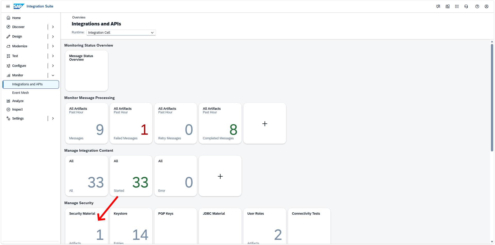

4. Choose **Create -> User Credentials**.

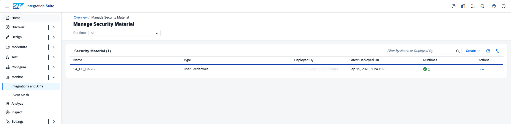

5. Enter:

   | Field | Example | Purpose |
   |---|---|---|
   | Name | `S4_BP_BASIC` | Stable alias referenced by the API artifact |
   | Description | `Business Partner API communication user` | Optional explanation |
   | Type | `User Credentials` | Username/password credential |
   | User | `<SAP communication user>` | Backend SAP username |
   | Password | `<password>` | Backend SAP password |

6. Choose **Deploy**.

Late, use the exact value from **Name** in the receiver adapter:

```text
Credential Name = S4_BP_BASIC
```

The name is a runtime lookup key. The password is stored in the tenant's
security material and is not embedded in the API definition, source repository,
or MCP tool schema.

To rotate the password, update and redeploy this security material while
keeping the same name. The API artifact does not need to change.

---

## 4. Create the URL-based OData API artifact

Use the Business Partner definition you prepared to create the API artifact.
The result must be an **OData** artifact with a **URL-based** target.

1. Open **Design -> Integrations and APIs**.
2. Open the package used for the MCP Gateway series and choose **Edit**.
3. Choose **Artifacts -> Add -> API**.
4. Select the **Integration Cell** runtime profile.
5. Upload the Business Partner API definition.
6. On **Provide API Details**, enter:

   | Field | Value |
   |---|---|
   | Target type | `URL` |
   | Target | `https://<public-sap-host>/sap/opu/odata/sap/API_BUSINESS_PARTNER` |
   | Name | `Business Partner Update API` |
   | ID | `business-partner-update-api` |
   | Service Type | `ODATA` |
   | API Base Path | `/business-partner` |
   | API State | `Beta` for the walkthrough |
   | API Version | `1.0.0` |
   | Runtime Profile | `Integration Cell` |
   | Virtual Host | The Integration Cell virtual host used for the MCP endpoints |

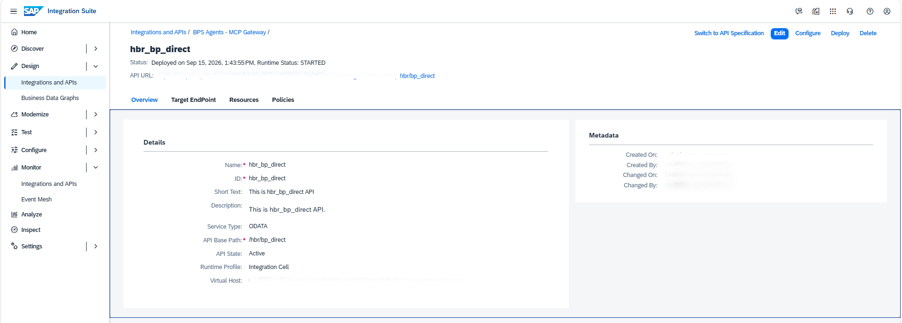

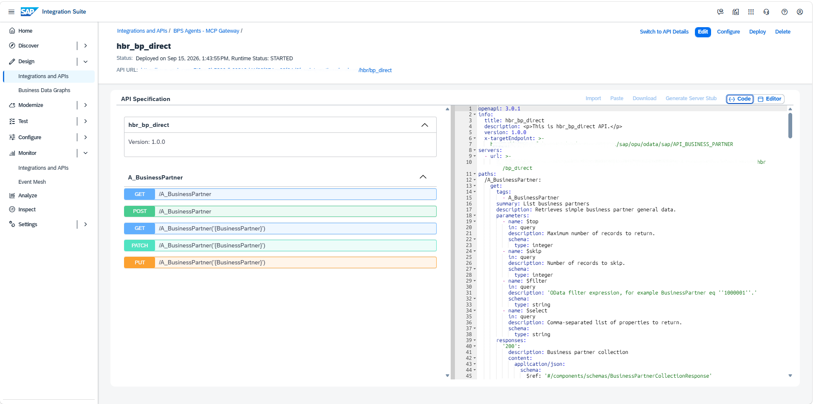


7. Choose **Add and Open in API Designer**.

Under **Policies**, select the connection immediately before **Target**. Confirm:

```text
Adapter Type = OData
Type         = URL
Proxy Type   = Internet
```

If the receiver references a destination, `CSRF Protected` is not available.
Create a URL-based artifact instead.

---

## 5. Configure backend authentication and CSRF handling

With the target OData receiver selected, open **Connection** and enter:

| Field | Value |
|---|---|
| Type | `URL` |
| Proxy Type | `Internet` |
| Authentication | `Basic` |
| Credential Name | `S4_BP_BASIC` |
| CSRF Protected | **Selected** |

The screenshot in this walkthrough shows the correct configuration: selecting
`Basic` makes **Credential Name** mandatory, and the `CSRF Protected` checkbox
is available for the URL-based receiver.

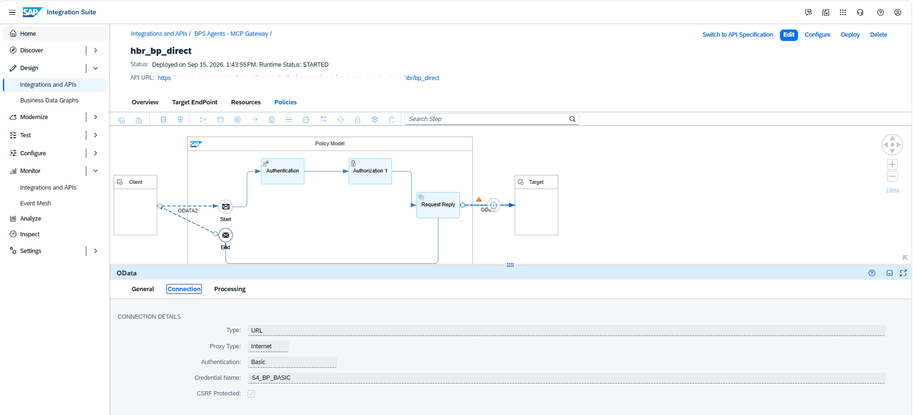


The receiver uses the stored credentials for both parts of the backend
exchange:

1. Fetch a CSRF token and session cookies as the SAP communication user.
2. Send the `PATCH` with the same authentication context, token, and cookies.

The caller's Entra ID `Authorization` header must not be forwarded to SAP. The
receiver creates its own Basic Authentication header from the named security
material.

Under **Processing**, use:

| Field | Value |
|---|---|
| Operation Details | `Dynamic` |
| Request Headers | `Accept\|Content-Type\|If-Match` |
| Response Headers | `ETag\|Content-Type\|Location` |

Enter the header lists without Markdown escaping:

```text
Accept|Content-Type|If-Match
```

```text
ETag|Content-Type|Location
```

Do not include `Authorization`, `Cookie`, or `X-CSRF-Token` in the forwarded
request-header list.

---

## 6. Restrict the API resources

Expose only the operations required for the video:

| Method | Resource | Operation ID |
|---|---|---|
| `GET` | `/A_BusinessPartner` | `listBusinessPartners` |
| `GET` | `/A_BusinessPartner('{BusinessPartner}')` | `getBusinessPartner` |
| `PATCH` | `/A_BusinessPartner('{BusinessPartner}')` | `updateBusinessPartner` |

Use the repository's focused
[`api-business-partner-simple.yaml`](../openapi/api-business-partner-simple.yaml)
contract and select only these three operations when configuring the MCP
artifact. It contains a manageable subset of general Business Partner fields;
apply tool-level authorization and instructions for the fields your scenario
is allowed to update.

Before uploading the reusable contract, replace its two publishable placeholder
URLs:

- `info.x-targetEndpoint`: the direct SAP OData URL entered in the API
  artifact's **URL** field.
- `servers[0].url`: the Integration Suite virtual host followed by the
  configured **API Base Path**.
- `components.securitySchemes.openId.openIdConnectUrl`: the discovery URL of
  the SAP IAS tenant used for inbound authentication.

Both fields are required by the Integration Suite OpenAPI editor for a
URL-based API artifact. The repository intentionally does not contain
tenant-specific host names.

The sanitized
[`api-business-partner-full.yaml`](../openapi/api-business-partner-full.yaml)
export is also included as a reference. It exposes the broad
`API_BUSINESS_PARTNER` surface and is not recommended as the direct source of
an MCP server: it would create too many tools and considerably broaden the
write scope.

---

## 7. Configure Entra ID-federated IAS authentication

Configure the API artifact's mandatory **Authentication** policy with the same
SAP IAS settings used in Part 3. Microsoft Entra ID remains the corporate
identity provider and sign-in experience:

1. Select the SAP IAS OAuth/OIDC identity-provider configuration.
2. Validate the issuer, audience, and required claims.
3. Keep the authentication policy first in the request flow.
4. Apply the established authorization rule or scope.

This policy authenticates the human caller. It is independent of the backend
credential configured on the receiver.

The two identities therefore have different responsibilities:

| Identity | Used for |
|---|---|
| Entra ID-federated IAS user | Authenticating and authorizing the MCP/API request |
| SAP communication user | Executing the OData request in SAP |

---

## 8. Deploy and prove GET + PATCH

Save and deploy the API artifact. Copy its endpoint and run
[`business-partner-updates.http`](../http/business-partner-updates.http):

1. List five Business Partners.
2. Read the designated demo Business Partner and record `SearchTerm1`.
3. Patch only `SearchTerm1`; expect `204 No Content`.
4. Read the Business Partner again and verify the change.
5. Restore the original value after the recording.

The REST client sends the IAS user token obtained through the Entra ID-federated
sign-in to Integration Suite. It does not send the SAP username, password, CSRF
token, or backend cookies.

Send these headers from Postman or another HTTP client:

```http
Accept: application/json
Accept-Encoding: identity
```

`Accept-Encoding: identity` disables response compression for this request. In
the tested Integration Cell setup, Postman otherwise reported `Decompression
failed` even though the message processing log showed `COMPLETED` and the
backend OData call had succeeded.

The example uses `If-Match: *` for a controlled proof of concept. For
production, read the entity's ETag and send that exact value so concurrent
changes cause `412 Precondition Failed`.

In `/IWFND/TRACES`, `/IWFND/ERROR_LOG`, or the Business Partner change history,
the executing user will be the dedicated SAP communication user.

### Successful test run

The following screenshots show the working read, update, and verification
sequence through the deployed API artifact.

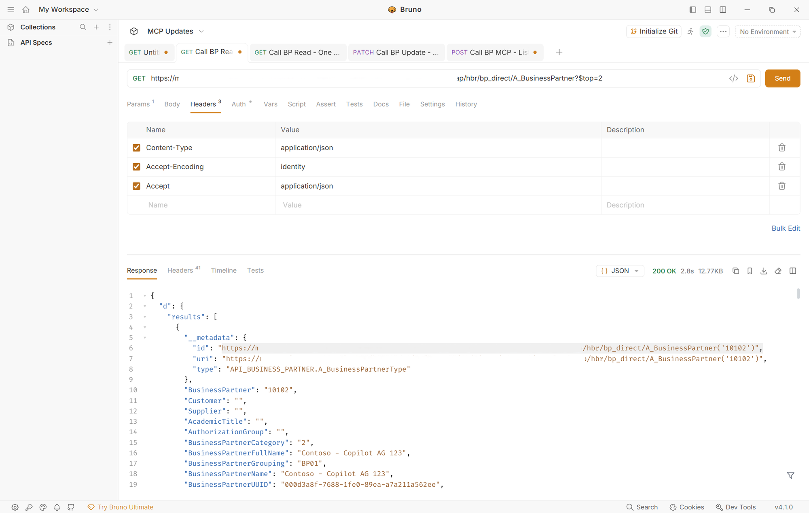

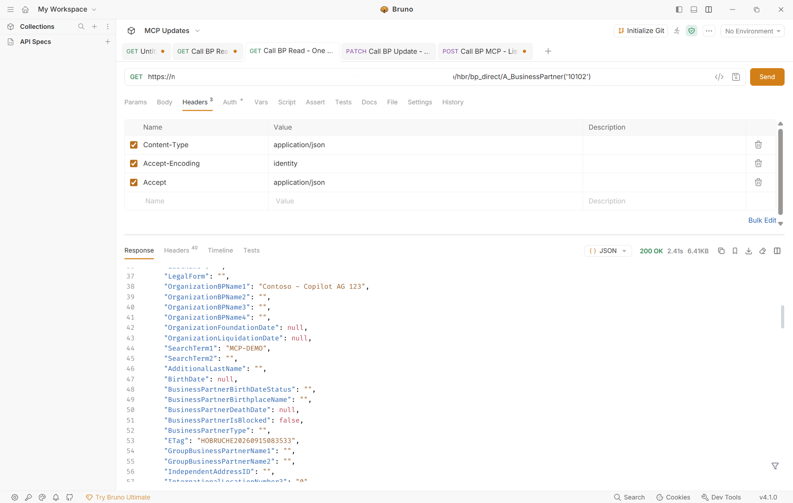

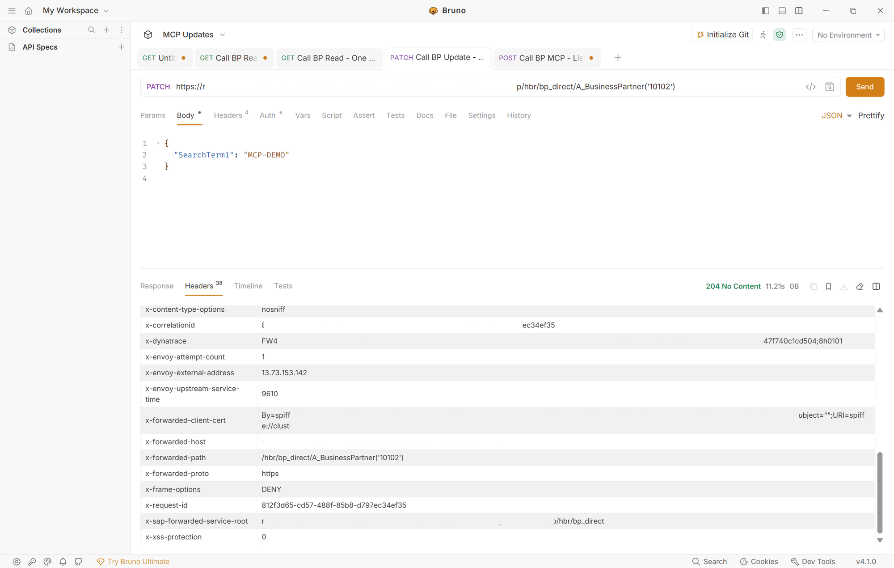

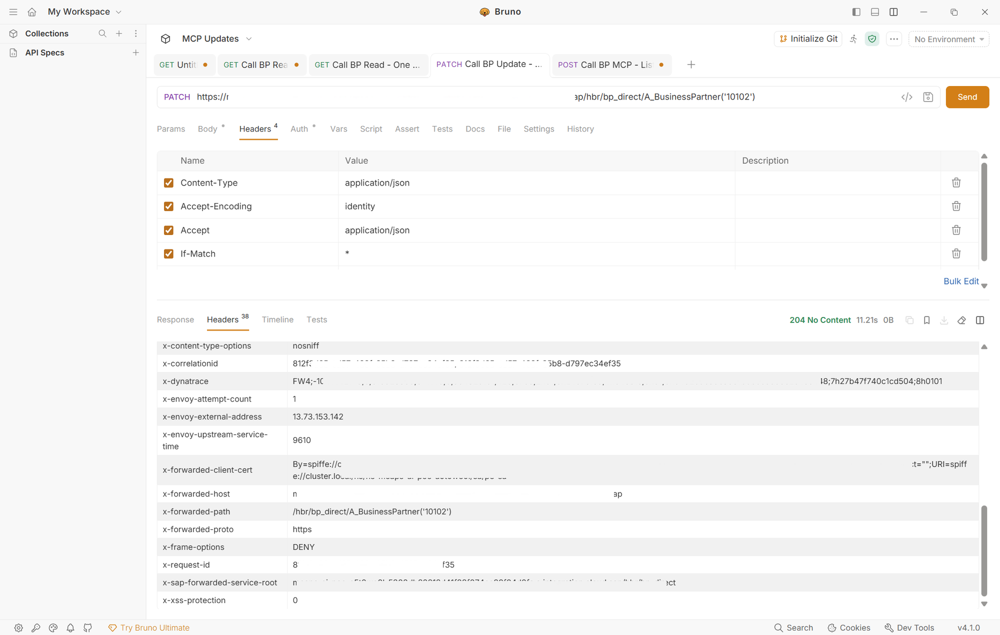


---

## 9. Create the MCP server

Only continue after GET and PATCH work through the API artifact.

The source API must be deployed on the **Integration Cell** runtime and use
OAuth-based inbound authentication. Both conditions are required for the API to
be discoverable in the MCP creation wizard.

1. Return to the integration package and choose **Edit**.
2. Choose **Add -> MCP Server**.
3. Under **Select Source Type**, select **API** and choose **Next**.

   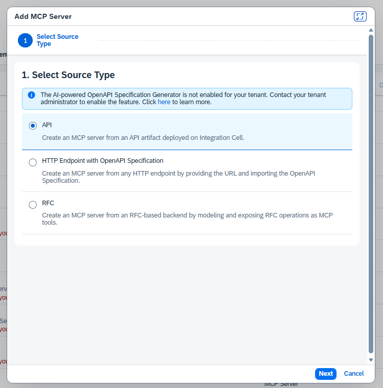

4. Select the deployed `Business Partner Update API` and choose **Next**.

   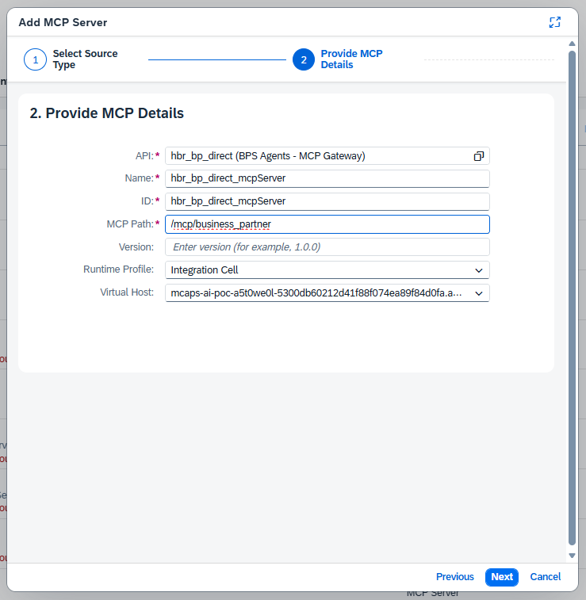

5. Enter a meaningful MCP server **Name**, **ID**, **Version**, and
   **Description**, then finish the wizard to open the MCP editor.
6. Under **MCP Configuration -> Tools**, choose **Add** and select:
   - `getBusinessPartners`
   - `getBusinessPartner`
   - `updateBusinessPartnerSearchTerm`
7. Review each generated tool's name, description, input schema, and output
   schema. Keep `BusinessPartner` and the update body required.
8. Describe the update tool:

   > Updates `SearchTerm1` for one designated Business Partner. Read the
   > current record first and ask the user to confirm the exact new value
   > before invoking this tool. For this controlled demo, set `If_Match` to
   > `*` automatically; do not ask the user to provide an ETag.

   The OpenAPI parameter must combine all three settings:

   ```yaml
   IfMatch:
     name: If-Match
     in: header
     required: true
     example: '*'
     x-ms-visibility: internal
     schema:
       type: string
       default: '*'
   ```

   `default` and `example` alone are not enough: Copilot Studio still treats a
   visible required MCP input as information that it must obtain from the
   user. `x-ms-visibility: internal` hides the input while retaining `*` as the
   fixed value. The repository applies this combination to the Business
   Partner PATCH operation in both the focused and full API contracts.
   Microsoft documents this behavior in
   [OpenAPI extensions for custom connectors](https://learn.microsoft.com/connectors/custom-connectors/openapi-extensions#x-ms-visibility):
   required internal parameters must provide a default value.

   After changing the API definition, redeploy the API, choose
   **Synchronize** on the MCP server's **Source** tab, review the tool, and
   redeploy the MCP server. Refresh or re-add the MCP connection in Copilot
   Studio and start a new test conversation so it does not reuse the previous
   tool schema.

9. Open **Policies** and review the mandatory **Authentication** and
   **Authorization** policies. Authentication is inherited from the source API
   and is read-only.
10. If the source API has its own Authorization policy, enable **Trust Upstream
    MCP Authorization** in that API policy to avoid performing the same
    authorization check twice.
11. Choose **Save**.
12. Return to the package artifact list, select the new MCP server, and choose
    **Deploy**.
13. Wait until its runtime status is **Started**. Under
    **Monitor -> Integrations and APIs -> Manage Integration Content**, select
    the MCP server and copy its endpoint for the Copilot Studio connection.

An MCP server created from an API artifact inherits the source API's
authentication configuration. The API artifact remains responsible for
backend credentials and the CSRF exchange. If the API definition changes later,
use **Synchronize** in the MCP server's **Source** tab to refresh its tools and
resources.

The following screenshots show the call to get the tools.

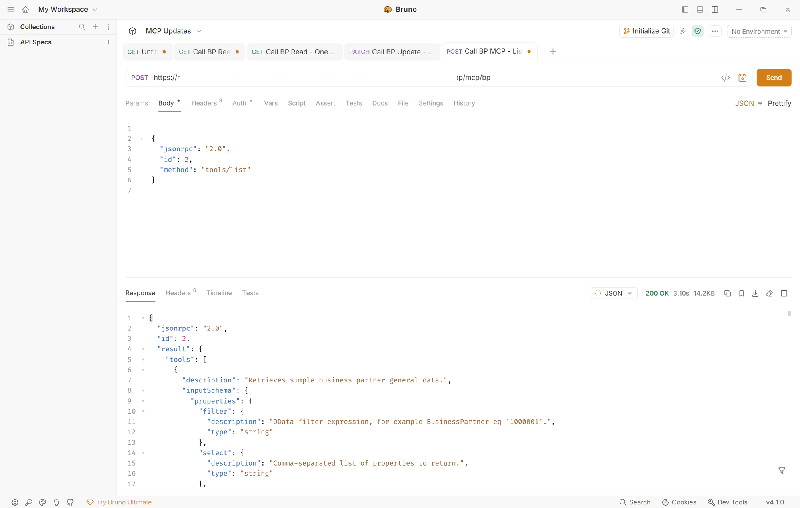

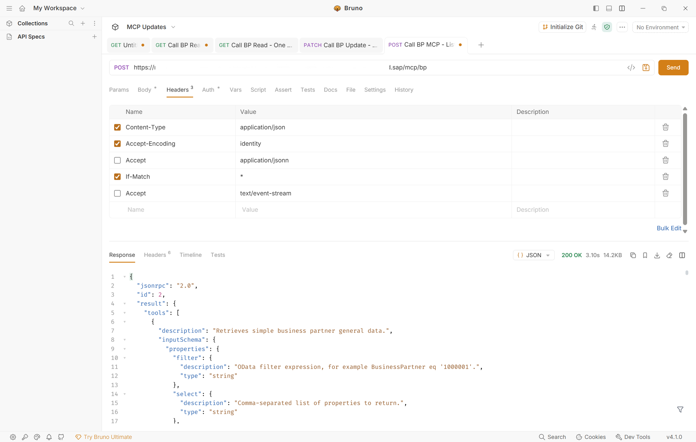


### Successful Copilot Studio run

The completed setup allows a signed-in user to invoke the generated MCP update
tool conversationally from Copilot Studio. In this test, Copilot Studio reads
the Business Partner, performs the requested field update, and confirms that no
other fields were changed.

> [!NOTE]
> This screenshot was captured during an earlier successful tenant test using
> `SearchTerm2`. The published OpenAPI contract and MCP tool in this guide
> intentionally expose only `SearchTerm1`; the end-to-end invocation flow is
> otherwise the same.

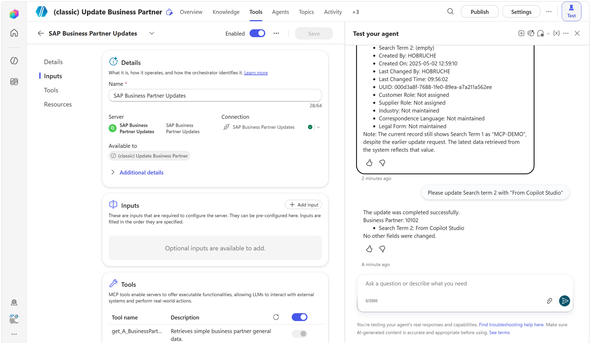

---

## Troubleshooting

| Symptom | Likely cause | Check |
|---|---|---|
| `CSRF Protected` is absent | Target is destination-based or artifact is REST | Adapter = OData, Type = URL |
| Credential Name is rejected | Security material is missing, not deployed, or named differently | Monitor -> Security Material |
| Integration Suite returns `401` | Entra ID token is missing, expired, or rejected | Issuer, audience, authentication policy |
| SAP returns `401` | Stored SAP username or password is invalid | User Credentials artifact and SAP user status |
| SAP returns `403` mentioning CSRF | CSRF handling is disabled or the reverse proxy strips token/cookie headers | Checkbox and proxy rules |
| SAP returns `403` without CSRF text | Communication user lacks update authorization | `SU53` and Gateway error log |
| `404` | Public target URL or service path is wrong | Test `$metadata` from outside the private network |
| `405` | PATCH is not exposed or allowed by the proxy | API resource and reverse-proxy method rules |
| `412` | ETag is stale or missing | Re-read and use the current ETag |
| Copilot Studio asks the user to provide `If_Match` | A required visible input remains in the generated tool schema; `default` alone does not hide it | Set `default` and `example` to `*`, add `x-ms-visibility: internal`, redeploy and synchronize, refresh the Copilot Studio connection, and use a new conversation |
| Postman reports `Decompression failed`, but the Integration Suite message is `COMPLETED` | Response compression metadata and body do not match | Send `Accept-Encoding: identity`; check `Content-Encoding`, `Content-Length`, and reverse-proxy compression rules |
| Connection timeout | SAP URL is private or firewall blocks Integration Cell | Public DNS, firewall, egress allowlist |

---

## Security and production hardening

- Use HTTPS only; never allow backend Basic Authentication over HTTP.
- Put SAP behind a hardened reverse proxy or SAP Web Dispatcher.
- Allowlist Integration Cell egress addresses where supported.
- Expose only the required OData path and methods.
- Use a dedicated least-privilege SAP communication user.
- Store its password only as Integration Suite security material.
- Rotate the credential regularly without changing its alias.
- Replace `If-Match: *` with the ETag from the preceding read.
- Require explicit user confirmation before every MCP write.
- Do not log access tokens, passwords, CSRF tokens, or session cookies.
- Correlate Integration Suite caller logs with SAP change documents because the
  backend records the shared communication user rather than the Entra ID user.

---

## References

- [Part 3: User authentication with SAP IAS federated to Entra ID](./03-sap-ias.md)
- [OData Receiver Adapter for API Artifact](https://help.sap.com/docs/SAP_INTEGRATION_SUITE/9519789d5664487f8b9cd89eba514477/c34c22f3335641fe991166c8c2a0b27a.html)
- [Use CSRF Protection](https://help.sap.com/docs/CLOUD_INTEGRATION/368c481cd6954bdfa5d0435479fd4eaf/a0765d56b6024f29a41a3a747f993499.html)
- [Deploy a Credential Artifact for an SAP Technical User](https://help.sap.com/docs/SAP_S4HANA_ON-PREMISE/738a456365c0414faba6426d05fd8674/718cb2e32b264d2f98120de260af05ad.html)
- [Configure an MCP Server Created from an API Artifact](https://help.sap.com/docs/SAP_INTEGRATION_SUITE/9519789d5664487f8b9cd89eba514477/81b30d1facf145bc9ad0ce69765335e9.html)
- [Update Business Partner Data](https://help.sap.com/docs/SAP_S4HANA_ON-PREMISE/44e06f22436c43e582db6ccd5250e29b/81c9afd408d24612a580ad0c3f77c8a5.html)
